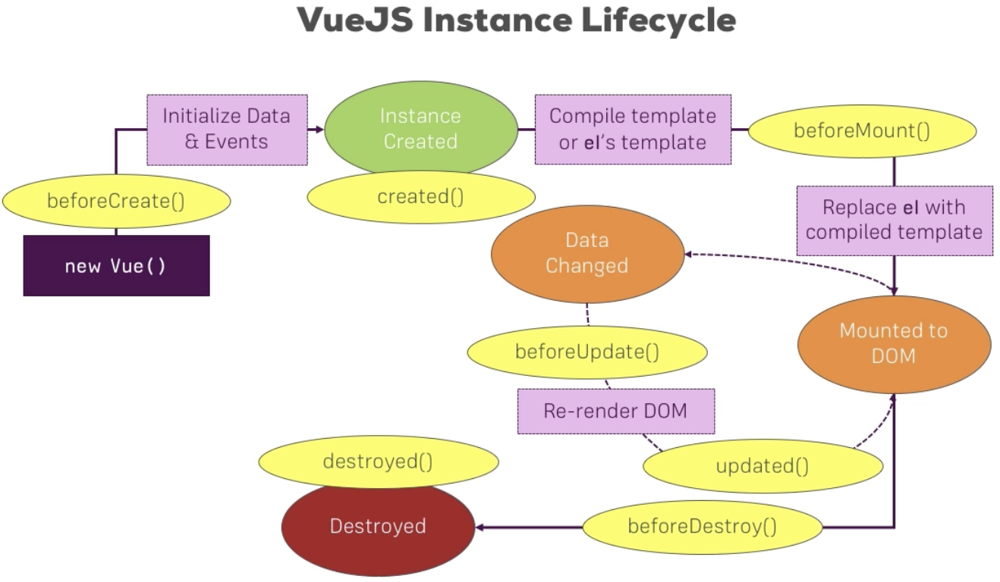
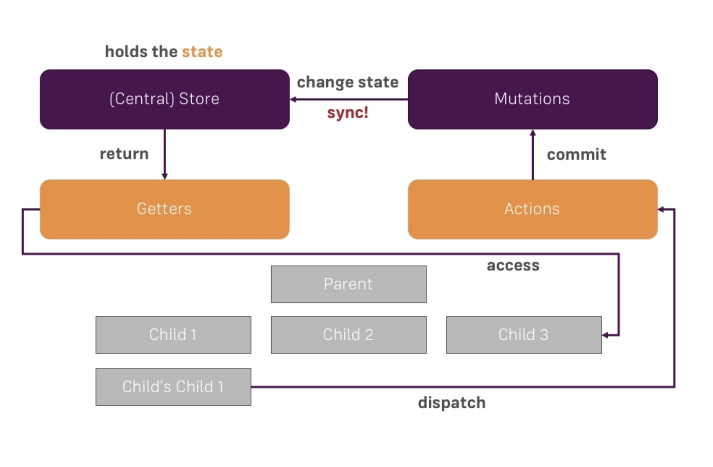

#  Learn Vue

Faster than  and  at runtime.


## The Basics

```javascript
new Vue();
```

New vue instance. Core of each piece of code. Instances have  one major job: contol thier own template of code w/c rendered to the screen.

### `el` property

```javascript
new Vue(
    el: ''
);
```

`el` is a very important reserved property of vue. The value is setup w/c part of the html code to under control by the view instance.

*Example:*

```html
<div id="app">
    <p>Hello vue!</p>
</div>
```

```javascript
new Vue(
    el: '#app'
);
```

### `data` property

```javascript
new Vue(
    el: '#app',
    data: {
        title: 'Hello vue'
    }
);
```

`data` stores all the data we want to use in this view instance. `{{ }}` is a special syntax to render variables/keys from data the property.

*Example:*

```html
<div id="app">
    <p>{{ title }}</p>
</div>
```

### adding a directive

```html
<div id="app">
    <input type="text" v-on:input="changeTitle">
    <p>{{ title }}</p>
</div>
```

`directive:[event]`

`v-on` directive. This will listen to some event.

### `methods` property

Where we setup our methods either from the template or within view instance.

*Example:*


```javascript
new Vue(
    el: '#app',
    data: {
        title: 'Hello vue'
    },
    methods: {
        changeTitle: function(event) {
            this.title = event.target.value;
        }
    }
);
```

`this` is referring to the `data` object. Basically it got access to all properties in `data` and methods stored in `methods`.

## Getting Started
Let's start diving super deep into Vue!

- [Interacting with the DOM (Templates)](#using-vuejs-to-interact-with-the-dom)

    How we can interact with the dom, with the data, bind to html attributes, listen events etc.

    - [Using Conditionals and Rendering Lists](#using-conditionals-and-rendering-lists)

- [Understanding the VueJS Instance](#understanding-the-vuejs-instance)

    Core object, how does it work, w/c lifecyle does it follow ?

- [Vue CLI](#moving-to-a-"real"-development-workflow-with-webpack-and-vue-cli)

    Provides easy-to-use and quickly to get started with templates.

- [Components](#an-introduction-to-components)

    A key concept of VuewJS. Build up applications thru components. Multiple modules on basics and advance concepts of components.

- [Forms](#handling-user-input-with-forms)

    How we can handle user inputs, use different form elements, create our own form control.

- [Directives, Filters & Mixins](#)

    How can it help us on our application?

- [Animations & Transitions](#)

    Learn how vuejs makes this very easy. How ti supports us animating or dynamic contents or switching component to another.

- [Working with HTTP](#)

    Reach out to server.

- [Routing](#routing-in-a-vuejs-application)

    How router works, how to set it up, how to use child routes and pass parameters ets.

- [State Management](#better-state-management-with-vuex)

    Managing the state in more complex apps, can quickly become a problem. **VueX** great additional package for state management.

- [Deploying a VueJS App](#)

    Deployment. How can we shift the application to a server.

### Using VueJS to interact with the DOM

#### Understanding VueJS Templates
VueJS creates a template based on our html code, stores that internally, and then uses the template to create the real html code, w/c then is rendered as the DOM.

#### How the VueJS Template Syntax and Instance Work Together
All properties in data and methods are accessible in your html. Proprties that should return something (string) that can be output on the html.

```html
<div id="app">
    <p>{{ changeText() }}</p>
</div>
```

```javascript
new Vue(
    el: '#app',
    data: {},
    methods: {
        changeText: function() {
            return 'Hello!';
        }
    }
);
```

#### Accessing Data in the Vue Instance
In javascript code accessing variables; the data and method properties should use `this`. `this` proxies all the vuejs properties, give us access anywhere under vue instance code.

```javascript
new Vue(
    el: '#app',
    data: {
        title: 'Hello!'
    },
    methods: {
        getText: function() {
            return this.title;
        }
    }
);
```

#### Building to Attibutes
We can't just use curly braces `{{}}` in html element attributes. The normal behaviour of html encodes / parsed them. We can only use them on where we put normal html texts.

We can still bind element attribute though, introducing a directive `v-bind`.

`v-bind:[attribute]`

```html
<div id="app">
    <a v-bind:href="link">Google</a>
</div>
```

```javascript
new Vue(
    el: '#app',
    data: {
        link: 'http://google.com'
    }
);
```

#### Understanding and Using Directives
An instruction you placed in your code. Vue shifts with builtin directives.

#### Disable Re-Rendering with *v-once*
Vue directive w/c rendered an element attached to it rendered only once. It keeps the initial value before it is overwritten.

```html
<p v-once>{{ title }}</p>
```

#### How to Output Raw HTML
Rendering html string on html do not read the string as html element. This is to avoid xss attacks.
To allow to render html we can use another directive `v-html`. But please this carefully.

```html
<div id="app">
    <span v-html="htmlLink"></span>
</div>
```

```javascript
new Vue(
    el: '#app',
    data: {
        htmlLink: '<a href="http://google.com">google</a>'
    }
);
```

#### Listening to Events
Using `v-on` directive to listen on events. Bind something in a template to pass data to it. Listen something and recieve something from a template.

`v-on:[event]="fn"`

```html
<div id="app">
    <button v-on:click="increase"></button>
    <span>{{ counter }}</span>
</div>
```

```javascript
new Vue(
    el: '#app',
    data: {
        counter: 0
    },
    methods: {
        increase: function() {
            this.counter ++;
        }
    }
);
```

#### Gettings Event Data from the Event Object
Every event holds an `event` object w/c can be accessed with our listeners.

```html
<div id="app">
    <span v-on:mousemove="updateCoordinates">Coordinates {{ x }} / {{ y }}</span>
</div>
```

```javascript
new Vue(
    el: '#app',
    data: {
        x: 0,
        y: 0
    },
    methods: {
        updateCoordinates: function(event) {
            this.x = event.clientX;
            this.y = event.clientY;
        }
    }
);
```

#### Passing your own Arguments with Events
You can pass arguments to your listener together the event object. VueJS fetches the default event and stores it to a protected variable `$event`;

```html
<div id="app">
    <button v-on:click="increase(2, $event)"></button>
    <span>{{ counter }}</span>
</div>
```

```javascript
new Vue(
    el: '#app',
    data: {
        counter: 0
    },
    methods: {
        increase: function(step, event) {
            this.counter += step;
        }
    }
);
```

#### Modifying an Event - with Event Modifiers
You can anytime modify an event like `event.stopPropagation()` fn, for example this listener is a child of a `mousemove` event listener.

**Event Access Modifiers**. Allows to modify an event.

`v-on:[event].[modifier]`

Ex:
This is the same function as the `event.stopPropagation()`

```html
v-on:mousemove.stop
```

You can also chain modifiers by adding `.`
This will  `event.stopPropagation()` and also `event.preventDefault()`

```html
v-on:mousemove.stop.prevent
```

#### Listening to Keyboard Events
**Key Access Modifiers**. keyboard event modifers

Ex:
Only execute function after entering after keyup.
`v-on:keyup.enter="fn"`

```html
<div id="app">
    <input v-on:keyup.enter="alertMe" />
</div>
```

```javascript
new Vue(
    el: '#app',
    methods: {
        alertMe: function() {
            alert('submit');
        }
    }
);
```

#### Writing JavaScript Code in the Templates
Write js expression on event bind value

Ex:
`v-on:click="counter++"`

Write js expression on display value (template expression)

Ex:
`{{ counter * 2 }}`
`{{ counter > 10 ? '> 10' : '< 10'  }}`

#### Using Two-Way-Binding
Both listen and output data. Using `v-model` to listen to keyboard event and output at the same time.

```html
<div id="app">
    <input type="text" v-model="name"/>
    <p>{{ name }}</p>
</div>
```

```javascript
new Vue(
    el: '#app',
    data: {
        name: ''
    }
);
```

#### Reacting to Changes with Computed Properties
Computed properties are methods that is used in template just like a variable data. Use `computed` key, this is where we store computed data outputed in the template.

**Important Note**: Computed properties are cached when results is still the same. meaning, the computed method will not be executed unless the return value could change.

```html
<div id="app">
    <p>{{ output }}</p>
</div>
```

```javascript
new Vue(
    el: '#app',
    data: {
        counter: 0
    },
    computed: {
        output: function() {
            // Executed only when the value changes
            return this.counter > 5 ? '> 5' : '< 5'
        }
    }
);
```

#### An Alternative to Computed Properties: Watching for Changes
`watch` (property): Executes code upon data changes. Key properties on `watch` refers to the key properties of `data`.

```javascript
new Vue(
    el: '#app',
    data: {
        counter: 0
    },
    watch: {
        counter: function(value) {
            // execute whenever the counter data changes
            // do something here
        }
    }
);
```

#### Saving Time with Shorthands
1. `v-on` can be replace with `@` sign
    Ex: `@click`

2. `v-bind` can be replace with `:`
    Ex: `:href`

#### Dynamic Styling with CSS Classes - Basics
Using click event to change the data and listen to that with class binding. Binding class property should expect an objec or just a class name, `key` as the class name and the value (boolean) to decide if needs to be display.

```html
<div id="app">
    <p :class="{red: attachedRed}"></p>
</div>
```

#### Dynamic Styling with CSS Classes - Using Objects
Bound class value can be also put into **computed** property, making it cleaner on the element.

```html
<div id="app">
    <p :class="colorClasses"></p>
</div>
```

```javascript
new Vue(
    el: '#app',
    data: {
        attachedRed: false,
    },
    computed: {
        colorClasses: function() {
            return {
                // [class name]: [is enable]
                red: this.attachedRed,
                blue: !this.attachedRed
            }
        }
    }
);
```

#### Dynamic Styling with CSS Classes - Using Names
Bound class value can be just a css class name.

```html 
<div id="app">
    <p :class="color"></p>
</div>
```

```javascript
new Vue(
    el: '#app',
    data: {
        color: 'green',
    }
);
```

**Important**
We can also attached multiple class names on class bind.

`<p :class="[color, 'red']"></p>`

And object can added also on the list:

`<p :class="[color, {red: attachedRed}]"></p>`

All classes with different types will just be merged into one list of classnames.

#### Setting Styles Dynamically (without CSS Classes)
Bind to a style property of an element and pass an object.

```html 
<div id="app">
    <!-- object key can be same with defualt style names: 'background-color'  -->
    <p :style="{backgroundColor: color}"></p>
</div>
```

The object value can be assigned as a computed data, making it more clean on the element.

```javascript
new Vue(
    el: '#app',
    computed: {
        myStyle: function() {
            return {
                backgroundColor: 'red',
                margin: 'auto'
            }
        }
    }
);
```

#### Styling Elements with Array Syntax
You can also add a value as an array: could be a variable data or object.

```html 
<div id="app">
    <!-- object key can be same with defualt style names: 'background-color'  -->
    <p :style="[myStyle, {backgroundColor: color}]"></p>
</div>
```

### Using Conditionals and Rendering Lists
Displaying array of data and  conditionally display elements.

#### Conditional Rendering with `v-if`

`v-if` A directive. Attaches / detaches elements to the DOM.

```html
<!-- data: show -->
<p v-if="show">You can see me!</p>
```

`v-else`

```html
<!-- data: show -->
<p v-else>Otherwise me!</p>
```

#### `v-else-if` in VueJS 2.1
`v-else-if` serves as an **else if block** for `v-if`. It can also be chained multiple times:

```html
<div v-if="type === 'A'">A</div>
<div v-else-if="type === 'B'">B</div>
```

#### Using an Alternative `v-if` Syntax
Using html5 `template` tag, to attach multiple elements under condition. `template` tag is not rendered on the html, we can use this as a wrapper.

```html
<template v-if="show">
    <p></p>
    <span></span>
</template>
```

#### Don't Detach it with `v-show`
`v-show` directive only hides an element. When set to false, it will automatically adds a `style="display: none;"` on the element.

```html
<template v-show="show">
    <p></p>
</template>
```

#### Rendering Lists with `v-for`
Loop the list data on the template.

```js
new Vue(
    el: '#app',
    data: {
        ingredients: ['meat', 'egg', 'pepper']
    }
)
```

```html
<div id="app">
    <ul>
        <li v-for="ingredient of incredients">{{ ingredient }}</li>
    </ul>
</div>
```

#### Getting the Current Index

```html
<div id="app">
    <ul>
        <!-- the firsr arg is an ITEM of array, second one is the INDEX -->
        <li v-for="(ingredient, index) in incredients">{{ ingredient }} {{ index }}</li>
    </ul>
</div>
```

#### Looping Through Objects

```js
new Vue(
    el: '#app',
    data: {
        persons: [
            { name: 'juan', age: '25'},
            { name: 'joe', age: '25'}
        ]
    }
)
```

```html
<div id="app">
    <ul>
        <li v-for="person in persons">
            <!-- loop key value pairs og an object, will get the value automatically -->
            <span v-for="value in person">{{ value }}, </span>
            <!-- juan, 25, -->

            <!-- can also get the key and index-->
            <!-- <span v-for="(value, key, index) in person">{{key}}: {{ value }}</span> -->
        </li>
    </ul>
</div>
```

#### Looping Through a List of Numbers
Convenient syntax if we want to count numbers.

```html
<div id="app">
    <div v-for="n in 10">{{ n }}</div>
</div>
```

#### Keeping Track of Elements when using `v-for`
Assign a unique key for each of the element to keep track of the position. Making it safe when we dynamically updates specific items. The elements won't reordered, VueJS already stores/remembers each unique element.

```html
<div id="app">
    <ul>
        <li v-for="ingredient in incredients" :key="ingredient">{{ ingredient }} {{ index }}</li>
    </ul>
</div>
```

### Understanding the VueJS Instance
How does this work, how it is created ?

#### Some Basics about VueJS instance
Vue instance is the middle man between the html code (DOM) and business logic. Pack all BL in the vue instance either in the data properties, methods or computed properties and others.

#### Using Multiple Vue Instances
Can create multiple instance. You acn only access properties with `this` to its own instance.

```html
<div id="app1">
    <span>{{ title }}</span>
</div>

<div id="app2">
    <span>{{ title }}</span>
</div>
```

```javascript
new Vue({
    el: '#app1',
    data: {
        title: 'First instance'
    }
});

new Vue({
    el: '#app2',
    data: {
        title: 'Second instance'
    }
});
```

#### Accessing the Vue Instance from Outside
By assigning a variable to an instance we can directly access/changed its properties from other instances.

```javascript
// vm - view model, vue naming conventions
var vm1 = new Vue({
    el: '#app1',
    data: {
        title: 'First instance'
    }
});

new Vue({
    el: '#app2',
    data: {
        title: 'Second instance'
    },
    methods: {
        changeTitle: function() {
            vm1.title = 'changed!';
        }
    }
});
```

#### How VueJS manages your Data and Methods
Vue instance properties are just converted to native object properties. Vue proxies all properties in the object so they are listened, watched. Manually adding prop to an object, vue doesn't setup any proxy to it.

#### A Closer Look at `$el` and `$data`
**vm** object consists properties `$el`, `$data`.

```javascript
vm.$data.title;
vm.$el;
```

`$el` is the actual html element

`$data` is the actual data object we assigned to `data` property of vue instance.

#### Placing `$refs` and Using them on your Templates
VueJS `ref` (not an official html attr) is a key w/c is recognized by VueJS. `$refs`, we can access all elements we setup.

Important: Adding/Changing properties directly the DOM, those properties are not reactive, not part of the vuejs template. VueJS just overrides them and use what was setup on the instance.

```html
<div id="app1">
    <span ref="myTitle">{{ title }}</span>
</div>
```

```javascript
var vm1 = new Vue({
    el: '#app1',
    data: {
        title: 'First instance'
    }
    showRefs: function() {
        console.log(this.$refs.myTitle);
        // { title: element }
    }
    updateMyTitle: function() {
        this.$refs.myTitle.innerText = 'updated by native html fn'
    }
});
```

#### Learn more about the Vue API
[http://vuejs.org/api/](http://vuejs.org/api/)

#### Mounting a Template
Using VueJS instance property `$mount()` to manually mount an element reference other than on `el` property.
Properties with `$` are native apis of vue.

```javascript
vm.$mount('#app');
```

#### Setting up costum template

```html
<div id="app">
</div>
```

```javascript
var vm = new Vue({
    template: `<h1>title</h1>`
});

vm.$mount('#app');
```

The template string will be mounted to id `app` on the html.

Mounting a template can be manual also:

```javascript
// first mount the tempalte (no target element here)
vm.$mount();
// do the native js
document.getElementById('app').appendChild(vm.$el);
```

#### Using Components

```javascript
// the second acts like object in a vue instance
Vue.component('hello', {
    template: '<h1>hello</h1>'
});
```

```html
<hello></hello>
<hello></hello>
```

#### Limitations of some Templates
Using template property (string) limits ide support like syntax highlights etc.

#### How VueJS updates the DOM
`Vue Instance <--- watch ---> Virtual DOM --> update ?  --> DOM`

**Virtual DOM** - representation of a real DOM, a copy parsed in javascript and quick to be access.
To w/c property did change or w/c part of the template is affected, that will goes out to the real DOM and updated that part.

#### The VueJS Instance Lifecycle


#### The VueJS Instance Lifecycle in Practice
How to add this lifecycle methods on the vue initialization.

```javascript
new Vue({
    el: '#app',
    data: {
        title: 'The VueJS instance'
    },
    beforeCreate: function() { /* before this instance is created */ },
    created: function() { /* this instance is created */ },
    beforeMount: function() { /* before the compiled template displayed to DOM */ },
    mounted: function() {  /* the template is mouted to DOM */ },
    beforeUpdate: function() { /* before this instance is being updated by property changes */ },
    updated: function() { /* instance is updated */ },
    beforeDestroy: function() { /* before this instance is destroyed */ },
    destroyed: function() {}
});
```

[More about VueJS Instance](http://vuejs.org/guide/instance.html)

### Moving to a "Real" Development Workflow with Webpack and Vue CLI
**Development Workflow**. Developing a project should come with set of tools to build effeient apps.
Compilers for vue templates, selectors, transpiler for ES6, TS to vanilla js, Sass to css, minifiers are examples for pre-processes before an app is run and ready.

**Development Server**. Running our app should be fetched from Http. In this case we will need to install `NodeJS` and `vue-cli` toolkit. `vue-cli` handles this already. By running your app locally it will be hosted by local machine and accessing thru `http://` already. That won't difficult if we publish the app to a production server.

Using `vue-cli@2`

```bash
$ sudo npm install -g vue-cli
```

4 templates used:
1. simple - Vue CDN, index.html
2. webpack-simple - Basic Webpack Workflow
3. webpack - Complex Webpack Workflow (Incl. Testing)
4. browserify - Browserify Workflows

Create a Vue project

`vue init [template] [project-name]`

```bash
$ vue init webpack my-app
$ cd my-app
$ npm install
$ npm run dev
```

#### Understanding `.vue` files
Vue file has a `<template>`, `<script>` and `<style>`. During build process with webpack, it will be compile to javascript code.

There is no need to specify what template to be used on the `<script>`. Vue automatically uses the template / html on that the same file.

#### Understanding Object in the Vue file.
The object behaves like a vue instance, we can use it as component.

#### How to Build your App for Production

```bash
$ npm run build
```

This will create a `/dist` folder. Which holds your bundle and it will also have an optimization in place there.

### An Introduction to Components
A major piece of VueJS.

Using the vue instance targeting an `id` or a `class`, repeating the element with this attribute value, vue won't repeat it, it will only use the first one. This where we can use Component instead.

Think of a component as an HTML element.

```html
<div id="app">
    <my-cmp></my-cmp>

    <!-- you can repeat it of course -->
    <my-cmp></my-cmp>
</div>
```

```javascript
// The 1st arg is your component name, will use just like a tag name in html.
// NOTE: Prefixing component name, making it more unique. So it won't interfere with existing one's like third parties

// The 2nd arg is an object w/c represents the component.
// The same object we're passing on a vue instance. Basically component extends Vue instance.
Vue.component('my-cmp', {
    // hence, data property as an object will interfere other objects. Vue will prompt an error.
    // component data is required to be a Function that returns an Object
    data: function() {
        return {
            status: 'Critical'
        }
    },
    template: '<p>status: {{ status }}</p>'
});
```

#### Storing Data in Components with the Data Method

```javascript
// Using shared data source will update all components and its data.
// !WARNING: This is an issue. vue data is mutable, and JS iby default will pass the variable reference.
// Don't do this! return an object literal directly from the data function instead.
var data = { status: 'Critical' };

Vue.component('my-cmp', {
    data: function() {
        return data;
    },
    template: '<p>status: {{ status }}</p>'
    methods: {
        changeStatus: function() {
            // vue automatically handles accessing data directly even if data property actually is a function.
            this.status = 'Normal';
        }
    }
});
```

#### Registering Components Locally and Globally

Global components are accessible anywhere. Using the `Vue` object and 

```javascript
Vue.component('my-cmp', {});
```

Local components are explicitly assigned in a variable and manually added to a Vue instance under `components` property.

```javascript
var myComponent = {} // Same object in the 2nd argument of Vue.component

Vue({
    data: {},
    components: {
        // key as the component name to use in html
        'my-cmp': myComponent
    }
});
```

#### The "Root Component" in the App.vue File
Better writing template alternative is to write in the same vue file. Now we won't experience the limitation of a template in a vue instance as a string.

Example below is an single file component (or vue instance in the ex)
```js
import Vue from 'vue';
import App from './App.vue';

// A root vue instance
new Vue({
    el: '#app',
    render: h => h(App) // using render function to replace everything
})
```

```html
<!-- Put this in the HTML section in JSFiddle! -->
<script src="https://unpkg.com/vue/dist/vue.js"></script>

<div id="app">
    <p>Status: {{ status }}</p>
</div>

<script>
    export default {
        // writing component's data should be in function type that returns an object
        data: function() {
            return {
                status: 'Critical'
            }
        }
    }
</script>
```

#### Creating a Component
Component can be created by creating new `vue` file.
Vue files as we know can have 3 different elements: template, script and style.

**Note**: template should have one root element!

```html
<template></template>
<script>
    export default {

    }
</script>
<style></style>
```

The component above did not defined the name of element. We can set its component selectors either locally or globally.

```js
Vue.component('my-home-component', Home); // we set it GLOBALLY, this component is visible and can be use anywhere in the src code.

// else locally, exclusive for this specific instance only.
Vue({
    ...
    components: {
        'my-home-component': Home
    }
})
```

#### Using Components
Using components locally within component (like parent component)

```html
<script>
import ChildComponent from './..';
// ChildComponent - we don't a imply a name here, its up to you. Because we literally don't have a name on the export. But keep it as pascal case!

export default {
    components: {
        'child-component-1': ChildCompnent // local component for this component only
    }
}
</script>
```

#### Better Folder Structure
For bigger projects, we can structure it by features:

```
├── src                               # App source code
│   ├── views                         # App views
│   │   ├── components                # Global components
│   │   │   ├── server                # Some specific feature-specific components
│   │   │   └── shared                # shared components across all codes
│   │   ├── modules                   # feature chunked views
│   │   │   ├── registration          # Some feature views, grouped toether
│   │   │   ├── dashboard             # can have thier own local components
│   │   │   └── public
```

#### How to Name your Component Tags (Selectors)
You can use case sensitive selectors. Because js is case sensitive.

eg.
```js
{
    appHeader: component1, // js style component naming, but you don't have to, hmtl component naming (with dash) is likely being used.
    'app-footer': component2
}
```

with this selector it can still be use in template as:

```html
<app-header></app-header>
```

vue already handle this.

#### Scoping Component Styles
Any style applied to a component is global, like a global styledsheet. 

By adding `scoped` attribute, then it will be contained on that component only.

```html
<style scoped>
<style>
```

Behind the scenes, this emulates a behaviour known **Shadow DOM**. The DOM, each element has a DOM behind the element. means like, an h1 tag van have DOM, with its own styles.

Using the `scoped`, this will add a unique attribute `data-v-xxxxxxxx` on the template of the component. As identifier that the styles are exclusive only for that template.

```css
div[data-v-xxxxxxxx] {
    border: 1px solid red;
}
```

### Communicating between Components
Learn to communicate different pieces of components.

#### Communication Problems
How do we get the data from the parent component?

#### Using Props for Parent => Child Communication
Transfering data from parent to child, we use something like `props` -- means properties to be passed.  

Implicitly passed props from outside

Parent Component:
Bind the data `name` to make it dynamic. Without binding, it will just pass the actual string.
```html
<app-user-details :name="name"></app-user-details>
```

Child Component:

```html
<template>
    <p>{{ name }}</p>
</template>
<script>
    export default {
        props: ['name'] // an array of string, string as prop name from outside.
    }
</script>
```

#### Naming Props
Single file template supports camel case prop names like - `myName`, but on the other hand DOM restricts this, should lowercase and with dash.

#### Using "props" in the Child Component
Props passed from parent can be access by the child as its normal data.

```html
<script>
    export default {
        props: ['name'],
        methods: {
            switchName() {
                return this.name.split("").reverse().join("");
                // we can normally use the props like its own data.
            }
        }
    }
</script>
```

#### Validating "props"
Validating the type of our props. We can setup the `props` as object with prop keys expected.

When a prop passed with different type, Vue will give a warning.

```js
export default {
    props: {
        name: String
    }
}
```

Additional validations for a prop can be nested into objects.

```js
export default {
    props: {
        name: {
            type: String,
            required: true,
            // default: 'Max' // if not required we can set a default also

            // whe a type is an object, 'default' key should be a function that returns an objects / array
        }
    }
}
```

#### Using Custom Events for Child => Parent Communication
All props passed to a child component are not the reference from the data of that parent component. I f we want to update the parent data when an event is called from child, we can use a custom event.

Parent:

```html
<!-- listening to an event using `v-on`, $event is the special pre-built argument that was passed by the handler -->
<app-user-detail :name="name" @nameWasReset="name = $event"></app-user-detail>
```

Child:

```html
<script>
export default {
    props: ['name']
    methods: {
        resetName() {
            this.name = 'Max'; // locally reset the prop name
            this.$emit('nameWasReset', this.name); // using builtin $emit fn, we can publish an event handler with argument.
        }
    }
}
</script>
```

#### Understanding Unidirectional Data Flow
Communication is **unidirectional**, it means it only travels from parent to children vv. Not the other way like child to child.

#### Communicating with Callback Functions
Another option a child can communicate to parent.

Parent:

```html
<!-- listening to an event using `v-on`, $event is the special pre-built argument that was passed by the handler -->
<app-user-detail :name="name" :resetFn="resetName"></app-user-detail>
```

Child:

```html
<template>
    <button @click="resetFn()"></button>
</template>

<script>
export default {
    props: {
        name: String,
        resetFn: Function // using the prop callback will execute the reference function from the parent component.
    }
}
</script>
```

#### Communication between Sibling Components
It's not possible! It needs to travel first on parent component to change that data to other siblings. We can use callback or custom events to update the parent data.

#### Using an Event Bus for Communication
Event Bus is a vue instance, it's like a centralized service with vue instance capabilities. To possibly communicate to remote component siblings we can use method like this. 

```js
// main.js

export const eventBus = new Vue({});
```

```html
<!-- child 1 -->
<script>
    import { eventBus } from './main';
    export default {
        methods: {
            resetName() {
                eventBus.$emit('nameWasReset', this.name);
                // $emit is a property of vue instance as we know.
            }
        }
    }
</script>
```

```html
<!-- child 2 -->
<script>
    import { eventBus } from './main';
    export default {
        methods: {
            ...
        },
        created() {
            // this is a lifecycle hook.
            // we can listen to events during this time
            eventBus.$on('nameWasReset', (name) => {
                this.name = name; // this will update the local data name.
            }); // this will listen to an event
        }
    }
</script>
```

#### Centralizing Code in an Event Bus
On the event bus we can also set a methods there, since this is just a vue instance like so:

```js
export const eventBus = new Vue({
    methods: {
        changeName(name) {
            this.$emit('nameWasChanged', name);
        }
    }
})
```

And just call this method from where this bus was imported:

```js
eventBus.changeName(name);
```

### Advanced Component Usage
Dive deeper to advance topics and features regarding components.

#### Passing Content - The Suboptimal Solution
VueJS offers us a so called `slots` so we can be able to pass html child elements from the defined component in html

```html
<app-qoute>
    <!-- need to these elements to app-qoute component -->
</app-qoute>
```

#### Passing Content with Slots
`<slot>` is a reserved vue component. When this is defined, it will display the elements passed from its user component.

```html
<app-qoute>
    <p>A wonderful day!</p>
</app-qoute>
```

```html
<div>
    <!-- the '<p>A wonderful day!</p>' will append here -->
    <slot></slot>
</div>
```

#### How Slot Content gets Compiled and Styled
1. The elements passed to that B component that is inserted to the `slot`, will be styled by the B component.
    WE CAN style the elements from the parent component that is to passed to slots. So that B component will render its defined styles.
2. Passing a data interpolation to elements that is to be passed will still work.

```html
<app-qoute>
    <!-- this works -->
    <p>{{ title }}</p>
</app-qoute>
```

#### Uing Multiple Slots (Named Slots)
Rendering elements to specific slots using named slots.

```html
<app-qoute>
    <h1 slot="title">A wonderful day</h1>
    <p slot="content">Lorem ipsum></p>
</app-qoute>
```

```html
<!-- Qoute -->
<div>
    <slot name="title"></slot>
    <slot name="content">Lorem ipsum></slot>
</div>
```

#### Default Slots and Slot Defaults
Unnamed elements slot, will be automatically rendered to default slot with no name`<slot></slot>`

If we wanted to have a default content for a slot while it's not yet provided by the parent component. We can just simply add a content on the specific `<slot>`

```html
<!-- 'The Subtitle' is displayed while there's no named slot from parent component, otherwise the slot content is replaced when occupied -->
<slot name="subtitle">The Sibtitle</slot>
```

#### A Summary on Slots
It helps distribute components, reusable widgets, switch slides with individual html layout.

#### Switching Multiple Components with Dynamic Components
**Dynamic Components**. Using `<component>` to dynamically sqitch display several components.
`<component></component>`. This selector is a reserved word. Allows us to add dynamic components.

```html
<template>
    <button @click="selectedComponent = 'appAuthor'">Switch to Author</button>
    <!-- 'is' atttribute should be bound to data that defines w/c component is active -->
    <component :is="selectedComponent"><p>Default Content</p></component>
    <!-- the '<p>Default Content</p>' here will be appended to default slot under the active component -->
</template>

<script>
    export default {
        data() {
            return {
                selectedComponent: 'appQoute' // the string is interpreted as a selector
            }
        },
        components: {
            appQoute: Qoute,
            appAuthor: Author
        }
    }
</script>
```

#### Understanding Dynamic Component Behavior
When components are switched, previous component were destroyed and created again when switch back.
The component dies, but there is a way we can override this behaviour.

#### Keeping Dynamic Components Alive
We can use a reserved keyword (component kind of) with `<keep-alive>`.
This make sures the compenent is still there and alive. Thus, we keep its local state.

```html
<keep-alive>
    <component :is="selectedComponent">
    </component>
</keep-alive>
```

#### Dynamic Component Lifecycle Hooks
We have two lifecycle hooks we can use in dynamic components. On `activated` (loaded) and `deactivated` (unloaded away).

For example; A component in dynamic components.

```js
export default {
    activated() {
        console.log('activated, loaded');
    },
    deactivated()  {
        console.log('deactivated, unloaded');
    }
}
```

### Handling User Input with Forms

#### A Basic `<input>` Form Binding
The basics; using `v-model` to two-way bind an input.

```html
<input type="email" v-model="email" />

<!-- ... -->
<p>Email: {{ email }}</p>
```

```js
export default {
    data() {
        return {
            email: ''
        }
    }
}
```

#### Grouping Data and Pre-Populating Inputs
Grouping input to one data object.

For example data:

```js
export default {
    data() {
        userData: {
            name: '',
            email: '',
            age: 27
        }
    }
}
```

Now form inputs should be:

```html
<input type="email" v-model="userData.email" />

<!-- ... -->
<p>Email: {{ userData.email }}</p>
```

#### Modifying User Input with Input Modifiers
By default data updates update per keystrokes.

```html
v-model.[mod].[mod]
```

Common modifiers:

- `.lazy` will only update the data once done (leaving the input)
- `.trim` - remove unnecessary white space on beggining ang end
- `.number` - force input to be a number

#### Binding `<textarea>` and Saving Line Breaks
The same with normal inputs to bind the data. With string interpolation or a text value inside textarea won't work as intended.

To keep the multiline from the textarea input as the value on display (string interpolated), we can use normal css style to do this.

```html
<p style="white-space: pre">Message: {{ message }}</p>
```

#### Using Checkboxes and Saving Data in Arrays
When there multiple checkboxes on form group, we can bind them with same property data. This will merge the values into an array on a data assigned.

```html
<label for="sendmail">
<input
        type="checkbox"
        id="sendmail"
        value="SendMail"
        v-model="sendMail"> Send Mail
</label>
<label for="sendInfomail">
<input
        type="checkbox"
        id="sendInfomail"
        value="SendInfoMail"
        v-model="sendMail"> Send Infomail
</label>

<!-- ... -->
<li v-for="item in sendMail">{{ item }}</li>
```

```js

data() {
    sendMail: [] // ['SendMail', 'SendInfoMail']
}
```

#### Using Radio Buttons
Making sure we only selected one. The data should be single value.

Everytime we select the pther, the previous will be unselected automatically
```js
data() {
    gender: 'Male'
}
```

```html
<label for="male">
<input
        type="radio"
        id="male"
        value="Male"
        v-model="gender"> Male
</label>
<label for="female">
<input
        type="radio"
        id="female"
        value="Female"
        v-model="gender"> Female
</label>
```

#### Handling Dropdowns with `<select>` and `<option>`
Similarly from the inputs, use `v-model` to bind the value on on the select input.
When `:selected` is hardcode-defined, it will be overriden by `v-model`

```js
export default {
    data() {
        return {
            priority: "High",
            priorities: ["High", "Medium", "Low"]
        }
    }
```

```html
<select
    id="priority"
    v-model="priority"
    class="form-control">
    <option v-for="priority in priorites">{{ priority }}</option>
</select>
```

#### What v-model does and How to Create a Custom Control
`v-model` does 2 things behind the schene:

1. `v-bind:value="data.name"` displays the value in realtime.
2. `@input="data.name=$event.taget.value"` change event, updates the data on change of input.

#### Submitting a form
Using submit button will normally trigger a request to a server. To prevent this, and async'ly fire a submit use:

`@click.prevent="submit"`

```js
methods: {
    submit() {
        console.log('submit!');
    }
}
```

### Routing in a VueJS Application
Switching routes from Vue SPA.

#### Setting up the VueJS Router (vue-router)

`npm install vue-router --save`

#### Setting Up and Loading Routes

To set up the routes, we need to:

1. Initialize vue router on `main.ts`
    ```js
    import VueRouter from 'vue-router';

    Vue.use(VueRouter);
    ```

2. Define your basic routes, put them sin separate file:
    ```ts
    import Home './..';

    export const routes = [
        { path: '/', component: Home },
        // ... more routes
    ]
    ```

3. Use your routes in `main.ts` main vue instance.
    ```ts
    import { routes } from './routes';

    Vue.use(VueRouter);

    const router = new VueRouter({
        routes
    });

    new Vue({
        el: '#app',
        router,
        render: h => h(App)
    })
    ```

4. We need to tell where to place/load the routes.
    ```html
        <!-- built in components this where the routed components goes into -->
        <router-view></router-view>
    ```

#### Understanding Routing Modes (Hash vs History)

`localhost:/#/`

The route after the hash tag handled by the javascript app to do routes other than submitting to server w/c we don't do on SPAs.

Using withoug hashtag style on routing `#`. We can `history` mode w/c can be setup like this:

```js
const router = new VueRouter({
    routes,
    mode: 'history' // the default mode is hash
});
```

#### Navigating with Router Links

Using the built-in component `<router-link>` to navigate to page instead of normal `<a>` tag.
The `router-link` do not re-render each page as the normal `a href` would do.

```html
<router-link to="/user">User</router-link>
```

#### Styling Active Links
We need to know what page are we on. By removing the parent `li` add override/use its class attribute [`active`].

It looks complicated honestly:

```html
<router-link to="/user" tag="li" active-class="active" exact><a>User</a></router-link>
```

The `exact` attribute is used to identify exactly the curren t active route to set a class as active.

#### Navigating from Code (Imperative Navigation)
In a vue instance we can access the `$router` property. We can trigger the navigation by calling `push`.

```js
this.$router.push('/'); // simple call
this.$router.push({ path: '/' }); // we could also pass an object
``` 

#### Setting Up Route Parameters
Passing a parameter that can be use by the component.

```js
{ path: '/user/:id', component: User }
```

#### Fetching and Using Route Parameters
To fetch the parameter dynamically from the route

```js
this.$route.params.id // for route `/user/:id`
```

#### Reacting to Changes in Route Parameters

When the same route changes but have different parameter. The next param will not be fetched because Vue resource use the same component resource. So to fix this issue we will apply a `watch` here.

Scenario:

`/user/1`
`/user/2`

```js
watch: {
    "$route"(to, from) {
        // to is just a route -- new route that is loaded
        this.id = to.params.id
    }
}
```

Another way is to pass the parameter as `prop` to the target component:

```js
{ path: '/hello/:name', component: Hello, props: true }, // Pass route.params to props
```

#### Setting Up Child Routes (Nested Routes)

Child routes can be nested using `children` property

```js
{ path: '/user', component: User, children: [
    { path: '', component: UserStart }, // root for /user
    { path: '/:id', component: UserDetail },
    { path: '/:id/edit', component: UserEdit }
] }
```

In this case we will be adding new `<router-view>` again on the `User` component, for the child route's component.

#### Navigating to Nested Routes

The same with navigating routes normally using `<router-link>`

```html
<router-link to="/user/1" tag="li">User</router-link>
<!-- tag="li" attribute as `<li> ... <li>` -->
```

#### Making Router Links more Dynamic

On the router link `to` attribute use bind so we can insert a js code, we can concatenate the param to construct the actual URL.

```html
<router-link tag="li" active-class="active" :to="'/user/' + $route.params.id + /edit">User</router-link>
```

#### A Better Way of Creating Links - With Named Routes

Routes can be named:

```js
{ path: '/:id/edit', component: UserEdit, name: 'userEdit' }
```

And in the `<router-link>` we can change the concatenation simply by:

```html
<router-link
    tag="li"
    :to="{ name: 'userEdit', params: { id: $route.params.id } }">
    User Edit
</router-link>
```

Adding names to routes can be use on navigating routes thru code also; much simplier and more clean.

```js
this.$route.push({ name: 'home' }); // can also pass params etc..
```

#### Using Query Parameters

Adding parameter in URL like `?a=b`. This can be added in the route object.

```js
this.$route.push({ name: 'home', query: { locale: 'en' } });
```

To access this on the code:

```js
this.$route.query.locale
```

#### Multiple Router Views (Named Router

Other than naming routes, we can also name route views like slots.

```js
export const routes = [
    { path: '/', components: {
        default: Home, // default for route '/'
        // the keys here relates to the `name` attribute in target component's <router-view>
        header: Header,
        footer: Footer
    } },
]
```

In the `Home` component"

```html
<route-view name="header"><route-view>
<!-- Unnamed w/c will be the target of the default component -->
<route-view><route-view>
<route-view name="footer"><route-view>
```

#### Redirecting

Cases like route is not covered by our routes, we need to redirect it to specific path.

```js
{ path: '/redirect-me', redirect: '/user' }
```

Once route is visited, automacally redirect to differen to route.

#### Setting Up "Catch All" Routes / Wildcards

Catch everything w/c is not handled by other of our routes

```js
{ path: '*', redirect: '/user' }
```

`*` is the wildcard character w/c catches all routes that did not handled by our routes.

#### Animating Route Transitions

How to animate by switching different routes. We can simply wrap the router view by transitions.
Checkout other animation styles and modes

```html
<transistion name="slide" mode="out-in">
    <router-view></router-view>
</transistion>
```

#### Passing the Hash Fragment

`#` default browser behaviour jumps to section of a page with a ref like `id="data"` with url hash `#data`

To add the hash thru routing we can:

```js
{ name: 'userEdit', params: { id: $route.params.id }, hash: '#data' }
// now we can pass the hash but it doesn't jump to section yet like the browser's normal behavious
```

#### Controlling the Scroll Behavior

In the route config we can use `scrollBehavior` prop  for control:

```js
const router = new VueRouter({
    routes,
    mode: 'history',
    scrollBehaviour(to, from, savedPos) {
        if (savedPos) {
            return savedPos; // return user po where he was at, switching back to prev route for example
        }
        if (to.hash) {
            return { selector: to.hash }; // automaticall scrolls to target section (using coordinates)
        }
        return { x: 0, y: 0 }; // setting the default pos, when accessing regukar routes
    }
});
```

#### Protecting Routes with Guards

Control the user if he is allowed to enter or leave the route.

#### Using the `beforeEnter` Guard

Basically we can add `beforeEach` in the router variable w/c exexcuted on every route actions.

```js
const router = new VueRouter({ .. });

router.beforeEach((to, from, next) => {
    // be aware that this is executed everytime.
    // some kind of generic, global checks here

    next() // pass nothing add continue the route.
    next(false) // it will abort
    next({ ... }) // or with params to redirect.
});
```

So to protect certain routes, we can setup `beforeEnter` like:

```js
{
    path: '/dashboard',
    component: Dashboard,
    name: 'dashboard',
    beforeEach: (to, from, next) { // so this guard is only available on this route
        // same setup from the global before each :)
    }
}
```

Another way is to imlement / use a `Vue Router` hook on the target component:

```js
beforeRouteEnter(to, from, next) {
    // as long as you dont call next() here the component instance will not initialize.

    /** If you access the instance here, it will be undefined.
     * to do this, next() provided a callback for us to access the component instance after it is loaded:
     *
     * next(vm => { vm.link; })
     */
    next(); // same rule from the route setup
}
```

#### Using the "beforeLeave" Guard

We can also use the `beforeLeave` hook on the component:

```js
beforeRouteLeave(to, from, next) {
    // do logic here


    next(); // navigate away
}
```

#### Loading Routes Lazily

We only load part of the application when we only need it. Saves performance for bigger application.
Lazy loading can be achieved by using webpack.

Laze loaded components are bundled separately. If route is visited it download that bundle.

```js
// syntax w/c webpack recognizes
const User = resolve => {
    require.ensure(['./components/User.vue'], () -> {
        resolve(require('./components/User.vue')) // webpack will load this when route is visited
    });
}

const routes = [
    { path: '/user', component: User }
]
```

### Better State Management with Vuex


Managing state for bigger application using VueX

#### Why a Different State Management May Be Needed

Local state management issue like passing data between children, might not good for bigger applications.
Using event bus is a way, but it can be pretty crowded. On a bus, changes is very hard to track.

#### Understanding "Centralized State"

The idea is to store in a central place that will hold a state. With this can be change/get data from different components.

#### Using the Centralized State

Create a `store` folder under your `src` folder

```js
// store.js

import Vue from 'vue';
import Vuex from 'vuex';

Vue.use(Vuex);

Vuex.store({
    state: { // not arbitrary name, need it for vuex.
        counter: 0;
    }
});
```

Set it up on vue instance

```js
// main.ts
import { store } from './store/store';

// same with route add it on vue instance config
new Vue({
    el: '#app',
    store, // store: store
    render: h => h(app)
});
```

Access the store from a component

```js
// $store property is provided from Vue.use(Vuex)
// this gives us the access to the central store
this.$store.state.counter++

// and in the displaying the data from another component, use `computed`
computed: {
    counter() {
        return this.$store.state.counter;
    }
}
```

#### Why a Centralized State Alone Won't Fix It

The above solutions still has flaws. Using the a getter (below) can be an eysore. Eventually you will be repeating the code all over the components and does not look good.

```js
this.$store.state.counter;
```

There is a better way to solve this issue:

#### Understanding Getters

Instead directly accessing state, we can create a `Getter`

This would get the state from the store, performs calculation it should perform.

#### Using Getters

```js
Vuex.store({
    state: { // not arbitrary name, need it for vuex.
        counter: 0;
    },
    getters: {
        doubleCounter: state => {
            state.counter * 2; // computed getter of state
        }
    }
});

// To access it from the component
this.$store.getters.doubleCounter;
```

#### Mapping Getters to Properties

A vuex helper to set getters directly as computed data.

```js
import { mapGetters } from 'vuex';

// ...

computed: mapGetters([
    'doubleCounter',
    'stringCounter'
]);

// Can also pass object
computed: mapGetters({
    anotherPropName: 'doubleCounter'
});
```

Using ES6 **spread** operator, we can still add our own computed properties:

```js
computed: {
    ...mapGetters([
        'doubleCounter',
        'stringCounter'
    ]),
    ourOwnComputedProp() {
        // ...
    }
};
```

#### Understanding Mutations

If we have getters we also have setters, b ut we call it **Mutations**. because it updates / changes the state.

This mutations are commited that will update a state.

```
--> COMMIT --> (MUTATIONS) --> CHANGE STATE (STORE)
```

#### Using Mutations

In the store setup, we can add a `mutations` property.

```js
Vuex.store({
    state: { // not arbitrary name, need it for vuex.
        counter: 0;
    },
    // ...
    mutations: {
        increment: state => {
            state.counter++;
        }
    }
});

// To use / commit this use:
this.$store.commit('increment');
```

To automatically add this to our methods, we can use `mapMutations`

```js
import { mapGetters } from 'vuex';

//...

methods: {
    ...mapMutations([
        'increment',
        'decrement'
    ]),
    ourOwnMethods() {
        // ...
    }
};

// this.increment
// @click="increment"
```

#### Why Mutations Have to Run Synchronously

This is to track mutations, adjustments of your state orderly.

#### How Actions Improve Mutatons

If we need to add asynchrounous task, we have to add an `actions` layer between component and mutations.

```
component ---> dispatch() ---> ACTIONS ---> commit() ---> MUTATIONS ---> change state ---> STORE
```

#### Using Actions

In the store setup, we can add a property `actions`. Actions are like methods.

```js
Vuex.store({
    state: { // not arbitrary name, need it for vuex.
        counter: 0;
    },
    // ...
    actions: {
        // parameter is a context object w/c you have an access to:
        increment: ({ commit, dispatch, getters }) => {
            commit('increment');
        },
        asyncIncrement: ({ commit }) => {
            setTimeout(() => {
                commit('increment');
                // commit('increment', data) second argument of mutation is the payload / data here
            }, 2e3);
        }
    }
});

// To use the actions directly

this.$store.dispatch('increment')
// this.$store.dispatch('increment', payload) pass payload as second argument
```

#### Mapping Actions to Methods

```js
import { mapActions } from 'vuex';
//...
methods: {
    ...mapActions([
        'increment',
        'decrement'
    ]),
    ourOwnMethods() {
        // ...
    }
};

// this.increment
// @click="increment"
```

**IMPORTANT NOTE:** You can't pass second argument to actions / mutations, dispatch only accepts 1 arg. Pass an object with many properties you want to use instead.

### More from Vuex

#### Two-Way-Binding (v-model) and Vuex

We cannot use`v-bind` to get and update state value, instead we can do the manual way;
By setting `:value` and `@input` to the input and setup `computed` and methods for this:

```html
<input type="text" :value="value" @click="updateValue" />
```

```js
//...
computed: {
    value() {
        return this.$store.getters('value');
    }
},
methods: {
    updateValue(event) {
        this.$store.dispatch('updateValue', event.target.value);
    }
}
```

There are another exception / rare way, if we want to bind the value.
By using `get` and `set` methods of computed data.

```js
//...
computed: {
    value: {
        get() {
            return this.$store.getters('value');
        },
        set(value) {
            this.$store.dispatch('updateValue', value);
        }
    }
},
```

So then in HTML

```html
<input :value="value" />
```

#### Modularizing the State Management

Improving our store by adding modules folder.
The idea of this, certain parts may have belong to different part of the appliction.

```
├── store
│   ├── modules                 # States grouped together as modules
│   │   ├── counter.js          # Some specific feature-specific components
│   │   └── value.js            # shared components across all codes
│   └── store.js                # main store
```

Inside the couter file, we can setup the `state`, `getters`, `mutatations` and `actions` similarly.

```js
// .. counter.js

const state = {
    counter: 0
}

const getters = {
    doubleCounter: state => {
        return state.counter * 2;
    }
}

const mutations = {
    increment(state, payload) => {
        state.counter += payload;
    }
}

const actions = {
    increment({ commit }, payload) {
        commit('increment', payload); // string is the mutation name
    }
}


export {
    state,
    getters,
    mutations,
    actions
}
```

To use the this module in the main store we will setup a module collector for that. Here, we will use the `module` property on store setup.

```js
import counter from './modules/counter';

Vuex.store({
    state: { // not arbitrary name, need it for vuex.
        counter: 0;
    },
    // ...
    modules: {
        counter
    }
});
```

#### Using Separate Files

Some actions, mutations, etc. remains in the main store setup, like shareable data for example. With that, the store file will grow bigger. 
We can separate the actions etc. to separate files.

```
├── store
│   ├── modules                 # States grouped together as modules
│   │   ├── counter.js          # Some specific feature-specific components
│   │   └── value.js            # shared components across all codes
│   ├── actions.js          # Some specific feature-specific components
│   └── store.js                # main store
```

`actions.js`

```js
export const updateValue = ({ commit }, payload) => {
    commit('');
}
```

And in the `store.js`

```js
import * as actions from './actions';

Vuex.store({
    state: { // not arbitrary name, need it for vuex.
        counter: 0;
    },
    actions,
    mutations,
    getters,
    modules: {
        // ..
    }
});
```

This makes the folder structure very clean and manageable!

#### Using Namespaces to Avoid Naming Problems

Case like different modules have the same method names. This can cause `[vuex] duplicate key error` error.
All methods specifically per `actions` etc. should be unique because we gathered it in single store.

Another pattern we can use especially for big applications:
We will provide action types for this, this assigns a unique name for the methods:

```js
// types.js
export const DOUBLE_COUNTER = 'counter/DOUBLE_COUNTER'; // prefixed with the module name!

// counter.js
import * from types from '../types';

export const getters = {
    [types.DOUBLE_COUNTER]: state => {
        return state.counter
    }
}
```

And in the component we can access this (for example a getter)
We can still use the `mapGetters` by assigning a different name.

```js
import * as types from '../types';

computed: {
    ...mapGetters({
        doubleCounter: types.DOUBLE_COUNTER
    })
}
```

#### Auto-namespacing to Avoid Naming

Check it [here](https://github.com/vuejs/vuex/releases/tag/v2.1.0)
